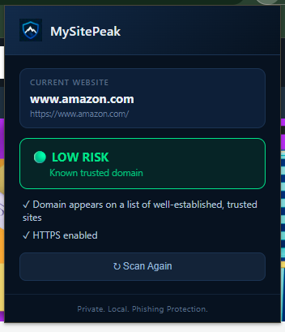
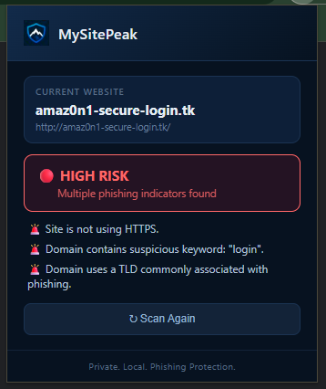

<p align="center">
  
</p>

<h1 align="center">MySitePeak</h1>

<p align="center"><strong>A local, privacy-first Chrome extension that detects phishing and suspicious websites in real time.</strong></p>

Built as a personal cybersecurity project to understand how phishing detection actually works — from URL-based heuristics to a locally-trained machine learning model — while keeping everything 100% local. No cloud services, no external APIs, no user data ever leaves the browser.

## 📸 Screenshots

<p align="center">
  
  &nbsp;&nbsp;&nbsp;
  
</p>

<p align="center"><em>Left: a trusted site correctly identified as low risk. Right: a suspicious URL flagged with clear reasoning.</em></p>

## ✨ Features

- **Real-time URL analysis** — automatically scans the active tab as you browse
- **Heuristic detection engine** — checks protocol, IP-based URLs, subdomain count, suspicious keywords, TLD reputation, punycode/homograph tricks, and brand-lookalike domains (e.g. `paypa1.com`)
- **Local machine learning model** — a Random Forest classifier trained on 500K+ labeled URLs, exported and running natively in JavaScript (no server, no API calls)
- **Known-domain allowlist** — cross-references the Tranco Top 1M domains list to avoid false positives on major legitimate sites
- **Live toolbar badge** — color-coded risk indicator (green/yellow/red) updates automatically as you browse
- **On-page warning banner** — visible alert injected directly into high-risk pages
- **Clean, structured popup UI** — shows current site, risk level, and clear reasoning

## 🌐 Browser Compatibility

MySitePeak is built on **Chrome's Manifest V3** extension standard, which means it works natively on any Chromium-based browser:

- ✅ Google Chrome
- ✅ Brave
- ✅ Microsoft Edge
- ✅ Opera
- ❌ Firefox *(uses a different extension architecture — not currently supported)*

## 🧱 Tech Stack

- **Extension:** JavaScript, Chrome Manifest V3 (Extension APIs, Service Workers, Content Scripts)
- **ML Pipeline:** Python, pandas, scikit-learn (Random Forest)
- **Data:** [Phishing Site URLs dataset](https://www.kaggle.com/datasets/taruntiwarihp/phishing-site-urls) (Kaggle), [Tranco Top 1M](https://tranco-list.eu/) domain list

## 🏗️ How it works

1. When you open the popup or navigate to a new page, MySitePeak reads the active tab's URL
2. It checks the domain against a local allowlist of well-established sites
3. If not on the allowlist, it runs a heuristic scoring engine (8 signal checks) and a locally-executed ML model (trained offline in Python, exported to JSON, and re-implemented in JavaScript for in-browser inference)
4. Results are combined into a clear Low / Medium / High risk verdict, shown in the popup, the toolbar badge, and (for high-risk sites) an on-page warning banner

## 🚀 Installation

Since this isn't published on the Chrome Web Store, install it manually:

1. Clone this repository:
```bash
   git clone https://github.com/parth15codes/MySitePeak.git
```
2. Open Chrome and go to `chrome://extensions`
3. Enable **Developer mode** (top right toggle)
4. Click **Load unpacked** and select the cloned `MySitePeak` folder
5. Pin the extension and start browsing — MySitePeak will analyze sites automatically

## 🔬 Retraining the ML model (optional)

The extension ships with a pre-trained model (`forest_model.json`), so this step isn't required to use the extension. If you want to retrain it yourself:

1. Download [phishing_site_urls.csv](https://www.kaggle.com/datasets/taruntiwarihp/phishing-site-urls) and place it in `ml/`
2. Download the [Tranco Top 1M list](https://tranco-list.eu/) and place it in `ml/` as `tranco_top1m.csv`
3. Set up a Python virtual environment and install dependencies:
```bash
   python -m venv venv
   source venv/Scripts/activate  # or venv/bin/activate on Mac/Linux
   pip install pandas scikit-learn joblib
```
4. Run the training and export scripts:
```bash
   cd ml
   python train_model.py
   python export_model.py
```

## ⚠️ Project Status

MySitePeak is an actively developed personal project, not a production-grade security tool. The ML model's confidence scores are currently logged for development purposes only (not shown in the UI) while accuracy is further improved. The heuristic engine is the primary, user-facing detection layer.

## 📄 License

MIT License — see [LICENSE](LICENSE) for details.