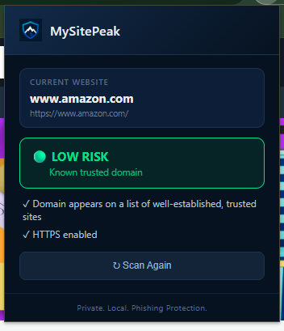
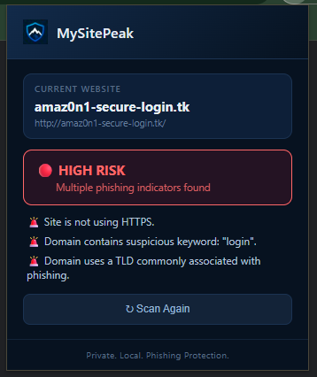

<p align="center">
  
</p>

<h1 align="center">MySitePeak</h1>

<p align="center"><strong>A local, privacy-first browser extension that detects phishing and suspicious websites in real time.</strong></p>

Built as a personal cybersecurity project to understand how phishing detection actually works — from URL-based heuristics to a locally-trained machine learning model to live webpage source analysis — while keeping everything 100% local. No cloud services, no external APIs, no user data ever leaves the browser.

## 📸 Screenshots

<p align="center">
  
  &nbsp;&nbsp;&nbsp;
  
</p>

<p align="center"><em>Left: a trusted site correctly identified as low risk. Right: a suspicious URL flagged with clear reasoning.</em></p>

## ✨ Features

- **Real-time URL analysis** — automatically scans the active tab as you browse
- **Heuristic detection engine** — checks protocol, IP-based URLs, subdomain count, suspicious keywords, TLD reputation, punycode/homograph tricks, and brand-lookalike domains (e.g. `paypa1.com`)
- **Local machine learning model** — a Random Forest classifier trained on 500K+ labeled URLs, exported and running natively in JavaScript (no server, no API calls)
- **Live page source analysis** — a separate, isolated module that inspects the actual webpage DOM for phishing patterns a URL alone can't reveal (see below)
- **Known-domain allowlist** — cross-references the Tranco Top 1M domains list to avoid false positives on major legitimate sites
- **Live toolbar badge** — color-coded risk indicator (green/yellow/red) updates automatically as you browse
- **On-page warning banner** — visible alert injected directly into high-risk pages
- **Terminal/HUD-style popup UI** — a vault-unlock animation reveals a monospace, corner-bracket "security console" interface showing current site, risk level, and clear per-signal reasoning

## 🔍 Page Source Analysis

Beyond URL-level heuristics and ML, MySitePeak includes a dedicated module (`source_analyzer.js`) that inspects the live webpage itself for phishing patterns — isolated from the core URL/ML detection so it can be developed, tested, and disabled independently.

**Live checks:**

| Check | What it detects |
|---|---|
| Login/password form detection | Presence of credential-harvesting forms (baseline signal) |
| Cross-domain form submission | A login form posting data to a domain other than the page itself |
| Insecure login form | A login form on plain HTTP, or submitting over HTTP |
| IP-based form action | A form submitting to a raw IP address instead of a domain |
| Brand/title-domain mismatch | Page title claims a brand (e.g. "PayPal") the domain doesn't match |
| Suspicious link text/domain mismatch | Link text names a brand but points to an unrelated, untrusted domain |
| Typosquat detection | Domain is a 1-2 character edit away from a known brand's real domain (Levenshtein distance) |
| Deceptive subdomain | A real brand's domain embedded as a fake subdomain (e.g. `paypal.com.security-verify.xyz`) |
| Clipboard hijacking | Inline scripts overriding copy/paste near what looks like a crypto wallet address |
| Urgency/account-security language | Phrases like "account will be suspended" commonly used in phishing pressure tactics |

Several checks are gated behind the Tranco allowlist (skipped entirely on already-trusted domains) specifically to avoid flagging legitimate sites — see **Design Decisions** below for why that gate exists.

**Deliberately shelved (built, tested, found unsafe to ship as-is):**

| Check | Why it was shelved |
|---|---|
| Hidden iframe detection | Legitimate sites (reCAPTCHA, payment widgets, chat tools) routinely use hidden iframes — too noisy to be a reliable signal |
| Hidden form detection | Same problem, even more common — mobile nav menus, search overlays, modals all hide real forms by design |
| Cross-domain meta-refresh | Real companies use this exact pattern for legitimate domain migrations (confirmed via Docker's own docs site); also prone to a timing race against the redirect itself |
| Punycode/IDN domain detection | `window.location.hostname` returns Punycode for *any* non-Latin domain, safe or malicious — would flag legitimate international websites |

Shelving a check that doesn't hold up under real-world testing, rather than shipping it anyway, is a deliberate choice — see below.

## 🧠 Design Decisions & Lessons Learned

A few judgment calls worth calling out, since they shaped how this module was built:

- **Real bugs were found and fixed through actual testing, not assumed away.** Early versions of the domain-matching logic failed on compound-suffix domains like `.co.in` and `.co.uk` (e.g. `airbnb.co.in` was initially misread as the domain `co.in`) — caught by testing against a real site, not a hypothetical.
- **A brand-mismatch check initially flagged BBC as impersonating HSBC**, and Shopify as impersonating Spotify, purely from incidental string similarity. The fix: skip the check entirely when the domain is already in the Tranco trusted list — the same fix later solved an identical problem with the urgency-language check (which otherwise flagged Google's own real account-security page).
- **A typosquat-detection list was deliberately kept small rather than expanded**, after simulating the false-positive rate of a larger brand list against 20,000 real popular domains: the larger list produced *more* than double the false collisions (flagging sites like BBC, CNN, and IBM as suspicious), not fewer — precision mattered more than coverage here.
- **Four checks were built, tested, and shelved** rather than shipped, once real-world testing showed each one's false-positive rate was too high to trust (see table above). A working feature that produces unreliable results is arguably worse than no feature at all.

## 🌐 Browser Compatibility

MySitePeak is built on **Manifest V3**, and works across all major browsers:

- ✅ Google Chrome
- ✅ Brave
- ✅ Microsoft Edge
- ✅ Opera
- ✅ Firefox *(tested working via Firefox's WebExtensions compatibility layer; manifest declares both `service_worker` and `scripts` background keys since Firefox doesn't yet support Chrome's service worker background model)*

## 🧱 Tech Stack

- **Extension:** JavaScript, Manifest V3 (Extension APIs, Service Workers, Content Scripts, cross-browser WebExtensions compatibility)
- **ML Pipeline:** Python, pandas, scikit-learn (Random Forest)
- **Data:** [Phishing Site URLs dataset](https://www.kaggle.com/datasets/taruntiwarihp/phishing-site-urls) (Kaggle), [Tranco Top 1M](https://tranco-list.eu/) domain list, brand-target data derived from PhishTank

## 🏗️ How it works

1. When you open the popup, a vault-unlock animation plays while the real scan runs underneath, then reveals the results — no fake delay, the animation is gated on the actual scan finishing
2. MySitePeak reads the active tab's URL and checks it against a local allowlist of well-established sites
3. If not on the allowlist, it runs a heuristic scoring engine (8 signal checks) and a locally-executed ML model
4. Separately, the SourceAnalyzer content script inspects the live page DOM for the signals listed above
5. Results from both layers are combined into a clear Low / Medium / High risk verdict, shown in the popup, the toolbar badge, and (for high-risk sites) an on-page warning banner

## 🚀 Installation

Since this isn't published on any extension store, install it manually:

**Chrome / Brave / Edge / Opera:**
1. Clone this repository:
```bash
   git clone https://github.com/parth15codes/MySitePeak.git
```
2. Open `chrome://extensions`
3. Enable **Developer mode** (top right toggle)
4. Click **Load unpacked** and select the cloned `MySitePeak` folder
5. Pin the extension and start browsing

**Firefox:**
1. Clone this repository (same as above)
2. Open `about:debugging#/runtime/this-firefox`
3. Click **Load Temporary Add-on...** and select `manifest.json` from the cloned folder
4. Note: temporary add-ons are removed when Firefox restarts — this is a Firefox limitation for unsigned extensions, not a MySitePeak issue

## 🔬 Retraining the ML model (optional)

The extension ships with a pre-trained model (`forest_model.json`), so this step isn't required to use the extension. If you want to retrain it yourself:

1. Download [phishing_site_urls.csv](https://www.kaggle.com/datasets/taruntiwarihp/phishing-site-urls) and place it in `ml/`
2. Download the [Tranco Top 1M list](https://tranco-list.eu/) and place it in `ml/` as `tranco_top1m.csv`
3. Set up a Python virtual environment and install dependencies:
```bash
   python -m venv venv
   source venv/Scripts/activate  # or venv/bin/activate on Mac/Linux
   pip install pandas scikit-learn joblib
```
4. Run the training and export scripts:
```bash
   cd ml
   python train_model.py
   python export_model.py
```

## ⚠️ Project Status

MySitePeak is an actively developed personal project, not a production-grade security tool. The ML model's confidence scores are currently logged for development purposes only (not shown in the UI) while accuracy is further improved. The heuristic engine and SourceAnalyzer module are the primary, user-facing detection layers.

## 📄 License

MIT License — see [LICENSE](LICENSE) for details.
